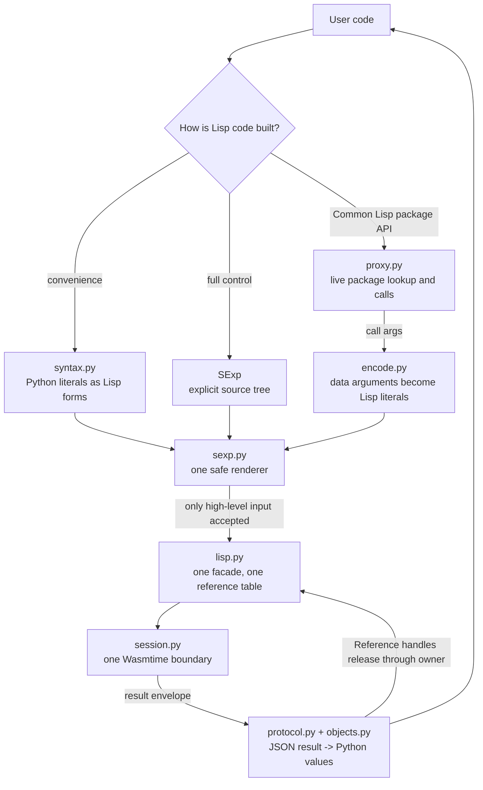
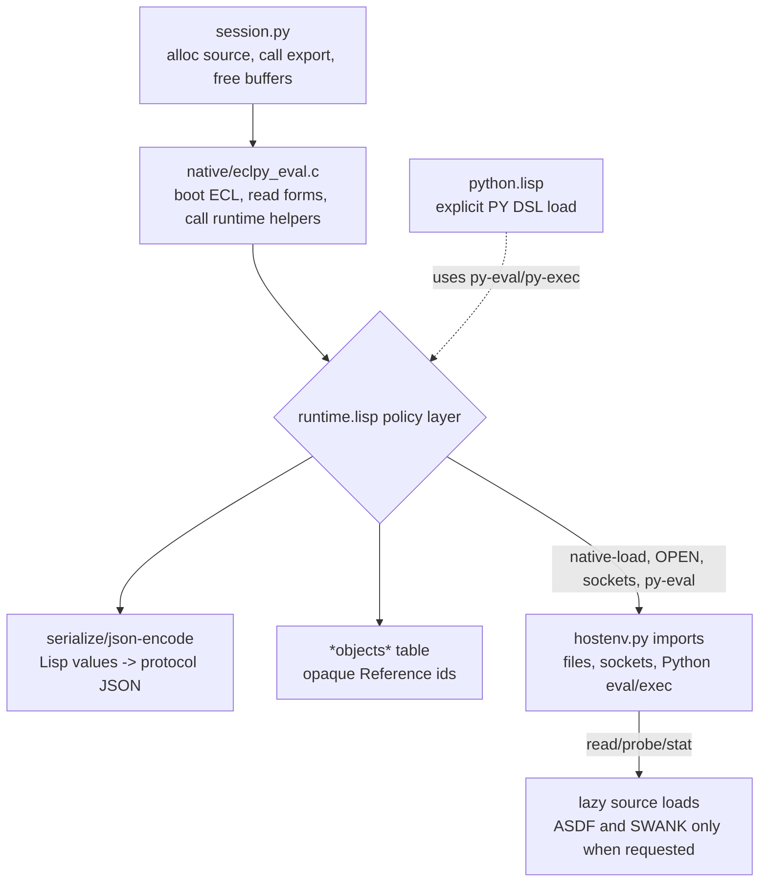
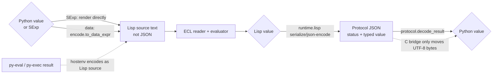

# Architecture

The runtime is layered so that each boundary has one responsibility.

The Python layer has three entry paths. They deliberately converge at
`Lisp._eval_sexp`, so all high-level calls share one reference table, one
JSON decoder, and one low-level session boundary.



The Wasm side is a separate boundary. The C bridge moves bytes and calls ECL;
`runtime.lisp` owns Lisp-level policy such as serialization, reference storage,
ASDF loading, Python eval/exec, and SWANK startup.



## Value Protocol

The two directions use different mechanisms, each owned by a different
module.

**Python -> Lisp** (`Lisp.eval`/proxy call arguments, and the Python value
a `py-eval`/`py-exec` call produces): `encode.py`'s `to_data_expr` renders
the value as literal Lisp source text -- numbers, strings, symbols, and
safely escaped string/symbol literals -- which ECL's own reader parses and
evaluates directly. No JSON is involved; the C layer never sees these
values, only the finished Lisp source string.

**Lisp -> Python** (every `Lisp.eval` result, including the value returned
by a `py-eval`/`py-exec` form): `protocol.py` owns decoding; the Lisp side
owns `serialize` in `runtime.lisp`. The C layer does not parse JSON and
does not interpret value fields; it only moves strings across the WASM
boundary and calls Lisp helper functions.



The wire shape for the Lisp -> Python direction is a JSON object with
named fields. Every top-level Lisp result is a protocol envelope:

```json
{"protocol": "eclpy", "version": 1, "status": "ok", "value": {}}
{"protocol": "eclpy", "version": 1, "status": "error",
 "condition_type": "SIMPLE-ERROR", "message": "boom"}
```

Value nodes use a `type` field plus named payload fields:

```json
{"type": "nil"}
{"type": "true"}
{"type": "int", "value": "42"}
{"type": "ratio", "numerator": "3", "denominator": "2"}
{"type": "float", "value": "1.5d0"}
{"type": "string", "value": "hello"}
{"type": "symbol", "name": "CAR", "package": "COMMON-LISP"}
{"type": "list", "items": [{"type": "int", "value": "1"}]}
{"type": "dotted-list", "items": [{"type": "int", "value": "1"}],
 "tail": {"type": "int", "value": "2"}}
{"type": "vector", "items": []}
{"type": "package", "name": "COMMON-LISP"}
{"type": "ref", "id": 7, "kind": "FUNCTION"}
```

Package lookup uses the same protocol/version envelope and returns exactly
one of `missing`, `callable`, `value`, or `symbol`:

```json
{"protocol": "eclpy", "version": 1, "kind": "missing"}
{"protocol": "eclpy", "version": 1, "kind": "callable",
 "callable_type": "function", "name": "+", "package": "COMMON-LISP"}
{"protocol": "eclpy", "version": 1, "kind": "value", "value": {}}
{"protocol": "eclpy", "version": 1, "kind": "symbol",
 "name": "FOO", "package": null}
```
