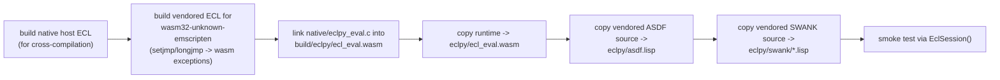

# For Developers

## Test

```sh
uv run ruff check .
uv run basedpyright
uv run python -m unittest discover -s tests
uv run coverage run -m unittest discover -s tests
uv run coverage report -m
uv run sphinx-build -b html docs docs/_build/html
```

The tests cover raw low-level evaluation, strict `SExp` evaluation, Syntax
API shorthand evaluation, package lookup, macros and special forms,
bidirectional Python/Lisp evaluation, object-shaped JSON protocol
conversion, cons/list conversion, higher-order Lisp functions, reference
lifecycle, `(require 'asdf)` module loading, missing runtime errors,
Lisp-side exceptions, internal runtime error paths, and the SWANK-RPC wire
protocol served by `Lisp.start_swank`. Coverage is configured to fail
below 100% for the Python package.

## Build the Sphinx Documentation

The documentation source is ordinary Markdown parsed by MyST plus Sphinx
autodoc pages that import `eclpy` docstrings. The Common Lisp runtime is
included with `literalinclude`, so changes to `runtime.lisp`, `python.lisp`, or
`swank/loader.lisp` show up in the generated site without duplicating source.

```sh
uv run sphinx-build -b html docs docs/_build/html
```

## Build the WASM Runtime

The wheel includes `eclpy/ecl_eval.wasm`, but that file must be generated
before building a distribution. The ECL source is vendored in
`vendor/ecl-26.5.5` and the SWANK server source is vendored in
`vendor/slime`; no source tarball or network fetch is required to build
the wheel itself. Local ECL build patches are kept under `patch/` and
applied only to copied source trees under `build/`.

```sh
uv run python scripts/build_ecl_wasm.py
```



## Build a Wheel

After generating `eclpy/ecl_eval.wasm`:

```sh
uv build --wheel --out-dir dist --clear
```

The wheel should contain:

```text
eclpy/__init__.py
eclpy/lisp.py
eclpy/syntax.py
eclpy/proxy.py
eclpy/protocol.py
eclpy/encode.py
eclpy/session.py
eclpy/hostenv.py
eclpy/wasmmem.py
eclpy/objects.py
eclpy/runtime_lisp.py
eclpy/runtime.lisp
eclpy/python.lisp
eclpy/sexp.py
eclpy/ecl_eval.wasm
eclpy/asdf.lisp
eclpy/swank/loader.lisp
eclpy/swank/packages.lisp
eclpy/swank/backend.lisp
eclpy/swank/ecl.lisp
eclpy/swank/gray.lisp
eclpy/swank/match.lisp
eclpy/swank/rpc.lisp
eclpy/swank/swank-core.lisp
eclpy/swank/swank-repl.lisp
```

You can smoke-test the built wheel outside the source tree:

```sh
uv run --no-project --isolated \
  --with dist/eclpy-0.1.0-py3-none-any.whl \
  python -c 'import eclpy; import eclpy.syntax as L; print(eclpy.Lisp().eval(L.expr(("+", 10, 32))))'
```

## Runtime Notes

The current Emscripten build emits a core wasm module that imports
`wasi_snapshot_preview1` plus Emscripten `env` functions. The Python
loader provides the minimal Emscripten compatibility shims needed by this
runtime. The build disables ECL's runtime stack-size probing on
Emscripten, avoiding the unsupported `prlimit64` startup syscall path.

ECL relies heavily on setjmp/longjmp for its condition system and binding
stack. The build lowers these to native WebAssembly exception handling
(`-sSUPPORT_LONGJMP=wasm -sWASM_LEGACY_EXCEPTIONS=0`) rather than
Emscripten's JavaScript `invoke_*` trampolines, which would otherwise
cross the wasm/host boundary on nearly every Lisp call. The loader enables
the matching wasmtime features (exceptions, function references, GC).
This is what makes loading large libraries such as ASDF practical.

WASI 0.3 requires a component-model toolchain/runtime path. The local
Emscripten 6.0.1 and `wasmtime` Python package used here do not expose
that path, so this package hosts the Preview 1 module directly.
