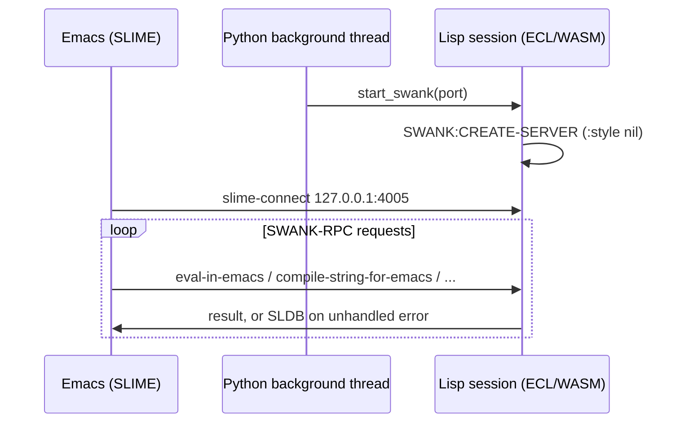

# SWANK/SLIME

`eclpy` bundles the unmodified upstream SWANK server source (from the
SLIME project) so Emacs can connect to a running `Lisp` session as a
normal SLIME REPL. Start the server with `Lisp.start_swank`, which blocks
the calling thread for as long as it serves requests, so run it from a
background thread:

```python
import threading

import eclpy

lisp = eclpy.Lisp()
thread = threading.Thread(target=lisp.start_swank, kwargs={"port": 4005})
thread.daemon = True
thread.start()
```

Then, in Emacs: `M-x slime-connect RET 127.0.0.1 RET 4005 RET`.

From the command line, `eclpy --swank` (or `eclpy --swank PORT`) starts the
server directly instead of the REPL, printing the port and blocking until
interrupted with Ctrl-C.



`start_swank` bypasses the JSON evaluation protocol used by `Lisp.eval` and
calls the session directly, so unhandled conditions raised while
evaluating a SWANK request reach ECL's native condition system instead of
being caught and reported back as an `EclError`.

## Limitations in the WASM Sandbox

- **No native compilation.** The sandbox has no C compiler and cannot
  `dlopen` shared objects, so `compile-string-for-emacs` and
  `compile-file-for-emacs` evaluate source directly instead of compiling
  to a FASL. Compiler errors and warnings are still reported to Emacs as
  compiler notes.
- **Interactive debugger (SLDB) works, with one patched primitive.**
  Walking ECL's raw interpreter history/frame stacks for a backtrace
  (`SI::IHS-TOP` / `SI::FRS-TOP`) works under this build, except reading
  interpreter-history-stack frame 0's environment, which is a sentinel
  with no real frame and hard-traps the WASM instance (not a catchable
  Lisp condition) rather than erroring cleanly as on native platforms.
  `start_swank` patches `call-with-debugging-environment` to skip that one
  index; the rest of SLDB (backtraces, restarts, frame locals,
  `eval-in-frame`) runs unmodified. Unhandled errors during a SWANK
  request open a normal interactive debugger buffer in Emacs.
- **Single-threaded.** This ECL WASM build has no real threads (`:threads`
  is absent from `*features*`), so the server always runs with
  `:communication-style nil`: one blocking, synchronous request loop per
  connection, exactly like a native single-threaded Lisp bound to Emacs.
